# <div align="center">
  


[](https://git.io/typing-svg)


---

### 🎯 **About Me**

```javascript
const muhammad_adnan = {
    location: "Pakistan 🇵🇰",
    role: "Full Stack Developer",
    specialization: ["React Native", "MERN Stack", "Mobile Development"],
    currentlyWorking: "Building next-gen mobile applications",
    learning: "Advanced React Native & Cloud Architecture",
    funFact: "I turn coffee into code ☕ → 💻",
    motto: "Code with passion, develop with purpose"
};
```


---

## 🏆 **GitHub Trophies**
<div align="center">
  
</div>

---

## 🔥 **My Stats Dashboard**

<div align="center">
  
  
  
  

</div>

<br/>

<div align="center">
  
  
</div>

<div align="center">
  
</div>

<div align="center">
  
</div>

---

## 🛠️ **Tech Arsenal**

<div align="center">

### **Frontend Mastery**


### **Styling & UI/UX**


### **Backend & Database**


### **State Management & Tools**


</div>

---

## 🚀 **What I'm Building**

```mermaid
graph TD
    A[💡 Ideas] --> B[🎨 Design]
    B --> C[⚡ Development]
    C --> D[🧪 Testing]
    D --> E[🚀 Deployment]
    E --> F[📈 Success]
    F --> A
    
    style A fill:#ff6b6b
    style B fill:#4ecdc4
    style C fill:#45b7d1
    style D fill:#96ceb4
    style E fill:#feca57
    style F fill:#ff9ff3
```

<div align="center">



</div>

### 🔥 **Current Focus Areas:**
- 📱 **Cross-platform Mobile Apps** with React Native
- 🌐 **Full-stack Web Applications** using MERN
- ⚡ **Performance Optimization** & Modern Architecture
- 🎨 **UI/UX Excellence** with Pixel-perfect Designs
- 🔧 **DevOps & Deployment** Automation

---

## 🌟 **Connect & Collaborate**

<div align="center">

### 📬 **Let's Build Something Amazing Together!**

[](mailto:adnan108123796@gmail.com)
[](https://twitter.com/@muhamma91828281)
[](https://linkedin.com/in/muhammad%20adnan)
[](https://fb.com/muhammad%20adnan)

### 💌 **Drop me a line:** `adnan108123796@gmail.com`

</div>

---

## 🎨 **Fun Zone**

<div align="center">

### 🐍 **Watch my contribution snake eat up my contributions!**


### 🎵 **Currently Coding To:**
[](https://open.spotify.com/user/31k6eaboi4dso3bjl3iu47mqnb7a)

### 💭 **Random Dev Quote**


### 😂 **Dev Humor Break**


</div>

---

<div align="center">

### 🚀 **"Code is poetry written in logic"**

**⭐ Star my repos if you find them interesting!**  
**🔄 Follow for more amazing projects!**  
**💬 Let's collaborate and build the future together!**

---


**Made with ❤️ by Muhammad Adnan | Full Stack Developer**

</div>
